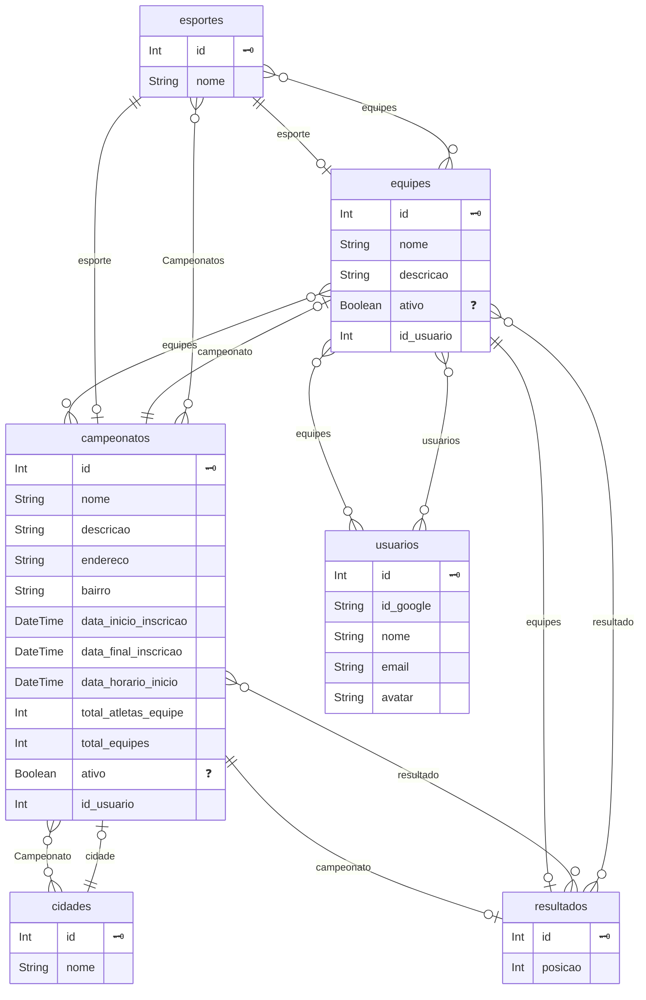

```mermaid
erDiagram

  "esportes" {
    Int id "🗝️"
    String nome 
    }
  

  "cidades" {
    Int id "🗝️"
    String nome 
    }
  

  "equipes" {
    Int id "🗝️"
    String nome 
    String descricao 
    Boolean ativo "❓"
    Int id_usuario 
    }
  

  "campeonatos" {
    Int id "🗝️"
    String nome 
    String descricao 
    String endereco 
    String bairro 
    DateTime data_inicio_inscricao 
    DateTime data_final_inscricao 
    DateTime data_horario_inicio 
    Int total_atletas_equipe 
    Int total_equipes 
    Boolean ativo "❓"
    Int id_usuario 
    }
  

  "usuarios" {
    Int id "🗝️"
    String id_google 
    String nome 
    String email 
    String avatar 
    }
  

  "resultados" {
    Int id "🗝️"
    Int posicao 
    }
  
    "esportes" o{--}o "equipes" : "equipes"
    "esportes" o{--}o "campeonatos" : "Campeonatos"
    "cidades" o{--}o "campeonatos" : "Campeonato"
    "equipes" o|--|| "esportes" : "esporte"
    "equipes" o|--|| "campeonatos" : "campeonato"
    "equipes" o{--}o "usuarios" : "usuarios"
    "equipes" o{--}o "resultados" : "resultado"
    "campeonatos" o|--|| "cidades" : "cidade"
    "campeonatos" o|--|| "esportes" : "esporte"
    "campeonatos" o{--}o "equipes" : "equipes"
    "campeonatos" o{--}o "resultados" : "resultado"
    "usuarios" o{--}o "equipes" : "equipes"
    "resultados" o|--|| "equipes" : "equipes"
    "resultados" o|--|| "campeonatos" : "campeonato"
```
